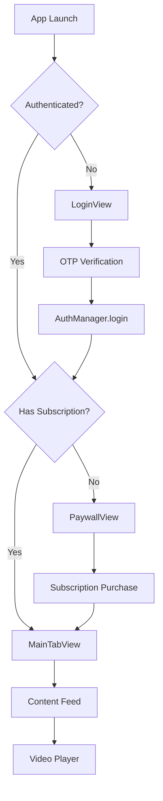

# ShortClips iOS 📱

A modern SwiftUI-based iOS application for streaming short-form video content, featuring user authentication, subscription management, and an engaging video feed experience.

## 🚀 Features

### Core Functionality
- **📱 Phone Number Authentication** - Secure OTP-based login system
- **💳 Subscription Management** - Freemium model with monthly/yearly plans
- **🎥 Video Streaming** - Short-form video content delivery
- **📺 Show-Based Content** - Organized content structure with episodes
- **👤 User Profiles** - Personal account management
- **🔄 Real-time Feed** - Personalized content discovery

### Demo Features
- **🧪 Demo Mode** - Use any 10-digit number + OTP: `123456`
- **📊 Sample Data** - Pre-loaded shows and episodes for testing
- **🎬 Sample Videos** - Working video URLs for demonstration
- **💾 Local Storage** - UserDefaults for demo persistence

## 🏗️ Architecture

### Tech Stack
- **Framework**: SwiftUI (iOS 14+)
- **Language**: Swift 5.0+
- **Architecture**: MVVM Pattern
- **State Management**: Combine + ObservableObject
- **Dependency Injection**: Environment Objects

### Project Structure
```
ShortClips/
├── 📱 App/
│   └── ShortClipsApp.swift          # App entry point
├── 📦 Models/                       # Data structures
│   ├── User.swift
│   ├── Show.swift
│   ├── Episode.swift
│   └── SubscriptionPlan.swift
├── 🎨 Views/                        # SwiftUI Views
│   ├── Authentication/             # Login & OTP
│   ├── Main/                       # Content feeds
│   ├── Profile/                    # User management
│   ├── Subscription/               # Paywall & plans
│   ├── Video/                      # Video player
│   └── Shared/                     # Reusable components
├── ⚙️ Managers/                     # Business logic
│   ├── AuthManager.swift
│   ├── SubscriptionManager.swift
│   └── ShowFeedManager.swift
├── 🌐 Services/                     # Data providers
│   └── SampleDataProvider.swift
└── 🔧 Utils/                        # Configuration
    ├── Config.swift
    ├── Constants.swift
    └── NetworkError.swift
```

## 🚀 Getting Started

### Prerequisites
- **Xcode 13.0+**
- **iOS 14.0+**
- **Swift 5.0+**
- **macOS 11.0+**

### Installation

1. **Clone the repository**
   ```bash
   git clone https://github.com/qanuj/shortclips-ios.git
   cd shortclips-ios
   ```

2. **Open in Xcode**
   ```bash
   open ShortClips.xcodeproj
   ```

3. **Build and Run**
   - Select your target device/simulator
   - Press `Cmd + R` to build and run

### Demo Usage

1. **Launch the app**
2. **Login with demo credentials:**
   - Phone: Any 10-digit number (e.g., `9876543210`)
   - OTP: `123456`
3. **Explore the content** - Sample shows and episodes are pre-loaded

## 🎯 Key Components

### Authentication Flow
```swift
LoginView → OTP Verification → AuthManager → ContentView
```

### Subscription Flow
```swift
PaywallView → Plan Selection → SubscriptionManager → MainTabView
```

### Content Flow
```swift
ShowFeedManager → SampleDataProvider → Video Content → Player
```

## 📱 App Flow



## 🔧 Configuration

### Environment Setup
The app supports multiple environments configured in `Utils/Config.swift`:

```swift
enum AppEnvironment {
    case development    // Demo mode with sample data
    case staging       // Testing environment
    case production    // Live environment
}
```

### Demo Data
Sample content is provided through `SampleDataProvider.swift`:
- **5 Sample Shows** with multiple episodes
- **Working video URLs** for testing
- **Mock user data** for authentication

## 🧪 Testing

### Demo Mode Testing
1. **Authentication:**
   - Phone: `9876543210`
   - OTP: `123456`

2. **Subscription:**
   - Automatically activated in demo mode
   - Test both monthly and yearly plans

3. **Content:**
   - Browse sample shows
   - Play demo videos
   - Test navigation flow

### Test Scenarios
- ✅ Login → Subscription → Content Access
- ✅ Logout → Re-login → State Restoration
- ✅ Subscription Flow → Content Unlock
- ✅ Video Playback → Navigation

## 🔮 Future Roadmap

### Phase 1 - Core Features
- [ ] **Real API Integration** - Replace demo data with live API
- [ ] **Video Player Enhancement** - AVPlayer implementation
- [ ] **Stripe Integration** - Real payment processing
- [ ] **User Profiles** - Profile editing and preferences

### Phase 2 - Enhanced Experience
- [ ] **Content Creation** - User-generated content upload
- [ ] **Social Features** - Comments, likes, sharing
- [ ] **Push Notifications** - Content updates and engagement
- [ ] **Offline Viewing** - Download for offline access

### Phase 3 - Advanced Features
- [ ] **Live Streaming** - Real-time video broadcasting
- [ ] **AI Recommendations** - Personalized content discovery
- [ ] **Analytics Dashboard** - Creator insights and metrics
- [ ] **Multi-language Support** - Localization

## 🛠️ Development

### Adding New Views
1. Create view file in appropriate category folder
2. Implement SwiftUI view with proper state management
3. Add navigation from parent views
4. Update any related managers if needed

### Adding New Features
1. Update models if new data structures needed
2. Create/update managers for business logic
3. Implement UI views with proper bindings
4. Test with demo data before API integration

### State Management
- **@StateObject** - For creating observable objects
- **@ObservedObject** - For receiving observable objects
- **@EnvironmentObject** - For app-wide shared state
- **@State** - For local view state

## 📋 Requirements

### Minimum Requirements
- iOS 14.0+
- Xcode 13.0+
- Swift 5.0+

### Recommended
- iOS 15.0+ (for latest SwiftUI features)
- Xcode 14.0+ (for enhanced previews)
- Physical device (for optimal video performance)

## 🤝 Contributing

1. **Fork** the repository
2. **Create** a feature branch (`git checkout -b feature/amazing-feature`)
3. **Commit** your changes (`git commit -m 'Add amazing feature'`)
4. **Push** to the branch (`git push origin feature/amazing-feature`)
5. **Open** a Pull Request

### Code Style
- Follow Swift API Design Guidelines
- Use SwiftUI best practices
- Maintain MVVM architecture
- Add comments for complex logic
- Write descriptive commit messages

## 📄 License

This project is licensed under the MIT License - see the [LICENSE](LICENSE) file for details.

## 👨‍💻 Author

**Anuj Pandey** - [@qanuj](https://github.com/qanuj)

## 📞 Support

For support, email support@shortclips.app or create an issue in this repository.

## 🙏 Acknowledgments

- SwiftUI community for best practices
- Apple for comprehensive documentation
- Open source video samples for testing

---

**Built with ❤️ using SwiftUI**